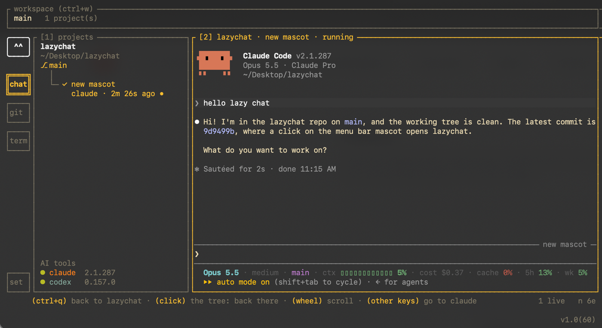
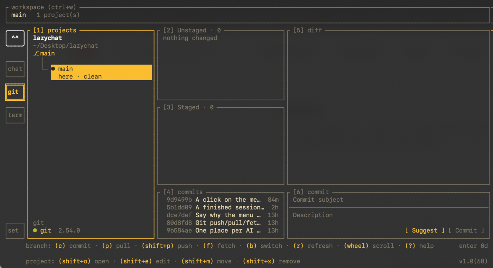
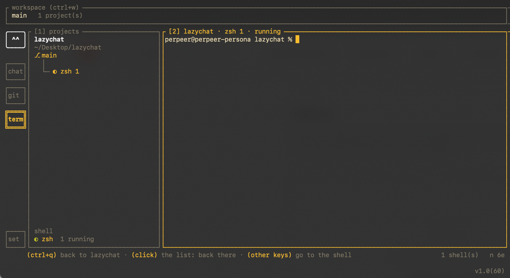

<p align="center">
  
</p>

<h1 align="center">lazychat</h1>

<p align="center">
  <b>One terminal for all your AI coding agents.</b><br>
  Run Claude Code and Codex sessions side by side, see at a glance which one needs you,<br>
  and keep Git and a shell for every project one key away.
</p>

<p align="center">
  <a href="https://github.com/perpeer/lazychat/stargazers"></a>
  <a href="#install"></a>
  
  
  <a href="LICENSE"></a>
</p>

<p align="center">
  <a href="#install">Install</a> ·
  <a href="#quick-start">Quick start</a> ·
  <a href="#features">Features</a> ·
  <a href="#reference">Reference</a> ·
  <a href="#inspiration">Inspiration</a>
</p>

<p align="center">
  
</p>

> ⭐ **Help bring lazychat to Homebrew.** Homebrew takes a project its author
> submits once it has **225 stars**. If lazychat saves you a few tabs,
> [star the repository](https://github.com/perpeer/lazychat/stargazers) —
> every star gets `brew install lazychat` closer.

## Why lazychat

Running several AI coding agents at once — one refactoring, one writing
tests, one chasing a bug — quickly turns into a wall of terminal tabs, and
the moment an agent stops to ask you something is easy to miss. lazychat
gives every agent session a home under its project, in one keyboard-driven
terminal UI, and tells you which one needs you.

- **Agents side by side** — Claude Code and Codex sessions, grouped by project, each in its own pane.
- **A mascot that watches them** — it shows which agent asks you something, which one finished or failed, and sends a desktop notification when you are away.
- **Git without leaving** — stage, diff, commit, worktrees, and a commit message written by the agent from your staged diff.
- **A shell per project** — plain terminals next to the agents, in the same folders.
- **Agent-agnostic** — the agent layer is built so more tools can plug in.

## Install

### Homebrew — coming soon

```sh
brew install lazychat
```

lazychat is on its way to Homebrew. Until it lands there, a
[⭐ star](https://github.com/perpeer/lazychat/stargazers) helps it get in
sooner, and installing from source takes a minute:

### From source

```sh
git clone https://github.com/perpeer/lazychat
cd lazychat
./install.sh
```

That builds `~/.local/bin/lazychat`, and installs Go 1.26 with Homebrew
first when it is missing. Make sure `~/.local/bin` is on your `PATH`. You
need macOS and at least one AI coding agent installed and logged in:
[Claude Code](https://code.claude.com/docs) or
[Codex](https://github.com/openai/codex). More on the script, the menu bar
helper and the iTerm keys in [Building from source](#building-from-source).

### Uninstall

```sh
./uninstall.sh            # or ./install.sh --uninstall
./uninstall.sh --purge    # also your lazychat data, to the Trash
```

It takes away the program, the menu bar helper and the iTerm keys, and
keeps your settings and workspaces unless you add `--purge`. Your projects
and Claude Code's and Codex's files are never touched. `--dry-run` shows
what would go. More in [Uninstalling](#uninstalling).

## Quick start

1. Run `lazychat` and make a workspace — a name for the set of projects you work on.
2. Press `o` and pick a project folder.
3. Press `n` to start an agent in it — Claude Code or Codex — and `Enter` to type into it. `ctrl+q` brings the keys back to lazychat.
4. Press `Tab` to go to Git or Terminal; `?` shows every key.

`lazychat doctor` tells you which agents can start a session, and why not.

## Features

### Agents, side by side

Every session lives under its project, remembered across runs, with its
terminal on the right. Start one with `n`, resume a saved one with `r`, and
type straight into it.

<p align="center"></p>

### Lazy, the mascot

Lazy, a small face on the side rail, watches every session. When an agent
asks you something, its name pops up above Lazy — click it and you are in
that session. It also tells you when an answer is done (with its first
line) or failed (rate limit, overloaded…), and sends a desktop notification
while your terminal is in the background. On macOS it lives in the menu bar
too.

### Git without leaving

Each project's changes as a folder tree, staged and unstaged, with diffs,
commits and worktrees. `Suggest` has an agent write the commit message from
what is staged.

<p align="center"></p>

### A shell per project

Plain terminals in your projects' folders, next to the agents.

<p align="center"></p>

## Reference

The rest of this page is the full reference: every screen, key and file.

## Overview

AI terminal sessions — Claude Code or Codex — in one terminal, laid out
like lazydocker. Register a project under a name, start a session in it,
and the right pane is that session's terminal: you type into it there.
Every session is started by lazychat and ends with it; lazychat manages
the sessions, and what happens inside them stays inside them. Four tabs
sit on a rail on the left: **Chat** (the sessions), **Git** (each
project's changes, commits and worktrees), **Terminal** (plain shells per
project) and **Settings**.

## Building from source

`./install.sh` builds `~/.local/bin/lazychat` from this checkout with Go
1.26 or newer (installed with Homebrew when missing). A clean tree that is
already installed reports `SAME`; anything else rebuilds, and the script
says when a running lazychat is still on the previous build.
`PREFIX=<dir>` installs elsewhere.

On macOS with `swiftc` (Xcode or its Command Line Tools) it also builds
`/Applications/Lazychat.app`, which puts Lazy, the mascot, in the menu bar (see Menu
bar) — so Finder, Launchpad and Spotlight show it and it starts from there
— with the mascot as its icon; a user who may not write `/Applications`
gets it in `~/Applications`. It is signed for this Mac only (`codesign -s -`, no
Apple account needed) and started again when its source changed. An
earlier `~/Applications/LazychatBar.app`, its name before, is quit and
replaced.

`./install.sh --iterm-keys` also makes iTerm send `⌘1`–`⌘4` as lazychat's
tab keys, taking them from iTerm's own tab switching; your other iTerm keys
are kept. Quit iTerm first, since it writes its settings back when it
quits, and it reads the keys when it starts.

`install.sh` writes nothing of Claude Code's or Codex's: your
`~/.claude/settings.json`, hooks and status line stay as they are. What
lazychat adds to a session (see How a session works) goes on that
session's command line only.

The version is `1.0(N)`, N the number of commits on the checked-out
branch. `install.sh` stamps it into the binary with the short hash
(`-dirty` when the tree has uncommitted changes); it shows as `v1.0(N)` at
the screen's bottom-right corner, and `lazychat --version` prints it with
the hash.

### Uninstalling

`./uninstall.sh`, or `./install.sh --uninstall` (which runs it), takes
back what installing and running put on the Mac, one line per piece:

- `$PREFIX/lazychat` (by default `~/.local/bin/lazychat`);
- `Lazychat.app` from `/Applications` (or `~/Applications`), quit first, and
  its macOS permissions (`tccutil reset All dev.lazychat.lazy`); an old
  `Lazy.app` or `~/Applications/LazychatBar.app` too;
- the iTerm keys `--iterm-keys` added — only `⌘1`–`⌘4`, and only those that
  still send lazychat's tab keys; quit iTerm first, as for installing them;
- Warp's launch configuration, `~/.warp/launch_configurations/lazychat.yaml`;
- the temp `lazychat-notices-*` folders of lazychats that are gone.

`~/.lazychat` — your settings and workspaces, with their projects' list and
sessions — stays, so a reinstall finds everything; `--purge` moves it to
the Trash. `--dry-run` lists what would go and changes nothing. It stops
while a lazychat runs, since quitting it would end its sessions; run it
again after. It never touches your projects, Claude Code's or Codex's
files, or Go (install.sh may have installed it with Homebrew; other tools
may use it). A login item you added for the menu bar helper is removed in
System Settings › General › Login Items. Run it twice and the second run
finds nothing left.

## Run

```bash
lazychat                     # the start screen: open a workspace, or make one
lazychat --workspace <name>  # that workspace; made when there is none of that name
lazychat doctor              # which AI tools can start a session, and why not; is the workspace readable
lazychat projects [list | add <path> [name] | rm <name|path>]
```

`doctor` prints one line per check — `ok`, `--` for an optional tool that
is not ready, `FAIL` — and exits non-zero on a `FAIL`; it fails only when
no AI tool can start a session. `doctor` and `projects` run on the newest
workspace and never ask; they only read, so they work beside an open
lazychat.

For tests, `--registry <file>` uses another list of workspaces (and its
folder as lazychat's home), `--trash <dir>` another Trash, `--home <dir>`
another folder in place of `~` where the AI tools keep their data (Claude
Code's `.claude`), `--tool <id>=<program>` a stand-in for that tool (once
per tool), and `--note-time` a shorter footer note.

## Workspaces

What lazychat keeps — the projects and the sessions it opened — lives in a
workspace, which is a name. Each has a folder of its own under
`~/.lazychat`, its name made safe as a file name (characters a file name
cannot hold become `-`):

```
~/.lazychat/
  workspaces.json                       the workspaces opened here: name, folder, when last opened
  settings.json                         the Settings tab's choices
  workspaces/<name>/workspace.json      its projects and sessions (versioned, written atomically)
  workspaces/<name>/workspace.json.bak  the version before the last save
  workspaces/<name>/lock                held while a lazychat has it open
```

Nothing of lazychat's is written into a project's folder. Claude Code's
transcripts stay where Claude Code keeps them, `~/.claude/projects`, and
are only read.

lazychat opens on the start screen every time: the workspaces, the one
opened last under the cursor. `Enter` opens it, `n` makes a new one (a
name), `e` renames one, `x` deletes one — its folder to the Trash, where
Finder can put it back, asked first. With none it is the form for a new
one. `--workspace <name>` skips the screen.

In the app the open workspace is the box across the top: its name and how
many projects it has. `Ctrl+W` or a click selects it; `↓` or `Esc`
goes back to the tab's list. Its keys:

| Key | Does |
| --- | --- |
| `n` | a new workspace — a name; it opens in place |
| `s` | switch to another — the others, the one used before this first; with none it says `n` makes one |
| `e` | rename it; its folder takes the new name, sessions keep running |
| `x` | delete it, asked: once what runs is stopped, its folder goes to the Trash and the start screen follows; the projects' folders stay |

Switching happens in the program: the tabs move onto the other workspace
and the screen stays. The sessions and shells of the one left are stopped,
asked first when any run; going straight back waits for them to stop. A
workspace that cannot be opened — held by another lazychat, its state file
unreadable — leaves you where you were, the reason on the footer; the start
screen comes back only at start and after a delete.

Nothing lazychat does leaves a workspace half written or written over:

- One lazychat at a time holds a workspace. A second is refused with the
  reason, on the start screen or, with `--workspace`, as an error. The lock
  goes with the process even when it dies.
- A state file that cannot be read is never written over: the start screen
  offers to put back its backup, keeping the broken file beside it as
  `workspace.json.broken-<time>`. A list or a settings file that cannot be
  read is set aside the same way and an empty one starts.
- A name whose folder another workspace has is refused, when one is made
  and when one is renamed.

## The screen

```
┌ workspace (ctrl+w) ────────────────────────────────────────────────────────────────────────────────┐
│ work   2 project(s)                                                                                │
└────────────────────────────────────────────────────────────────────────────────────────────────────┘
╭────╮┌ [1] projects ────────────────────┐┌ [2] app · fix-12 search box · running ───────────────────┐
│ ^^ ││ app                            1 ││ claude's own screen, drawn by the emulator               │
╰────╯│ ~/code/app                       ││                                                          │
      │ ⎇ main                           ││ …                                                        │
╔════╗│   │                              ││                                                          │
║chat║│   ├─ ◐ fix-12 search box         ││                                                          │
╚════╝│   │    claude · 42s ago •        ││                                                          │
┌────┐│   │                              ││                                                          │
│git ││   └─ ○ fix-8 settings page       ││ ❯ hello▏                                                 │
└────┘│        claude · 2h 16m ago       ││                                                          │
┌────┐│                                  ││                                                          │
│term││ web                            0 ││                                                          │
└────┘│ ~/code/web                       ││                                                          │
      │ ⎇ main                           ││                                                          │
      │   │                              ││                                                          │
      │   └─ no sessions yet             ││                                                          │
┌────┐│ AI tools                         ││                                                          │
│set ││ ● claude  2.1.0                  ││ Opus · high · main · ctx 28%                             │
└────┘└──────────────────────────────────┘└──────────────────────────────────────────────────────────┘
      session: (enter) continue · (n) new · (r) resume · (e) rename · (m) move · (x) close    v1.0(52)
      project: (shift+o) open · (shift+e) edit · (shift+m) move · (shift+x) remove
```

The rail holds one box per tab — chat, git and term, and set at its foot
for Settings — with the mascot at its top. The selected box is drawn in
double lines in the accent, its name bold. A click on a box switches tabs,
even while a session has the keys; `Tab` goes Chat → Git → Terminal while
a list has the keys and `Shift+Tab` back; `⌘1`–`⌘4` in iTerm after
`install.sh --iterm-keys`, also from inside a session. Settings is a click
or `⌘4` away, not `Tab`. Git and Terminal can be hidden in Settings; a
hidden tab is skipped by `Tab`, its `⌘` digit does nothing, and what it
runs carries on.

Each tab is an app of its own: the screen beside the rail, its keys and
its footer belong to the selected one, and only the window that has the
keys is framed in the accent. Every tab that lists the projects shows them
in the same order and keeps one choice between them: the project the
cursor was last on, in any tab, is the one the next tab comes into view on.
The projects column is as wide in Chat, Git and Terminal (28 % of the tab,
32 to 40 columns), so it stays put when the tab changes.

A project's heading is the same in every tab: its name in bold (wrapped to
two rows), its folder dim under it (wrapped to three rows, a longer one
keeping its tail) and the branch the folder is on in the accent: `⎇ main`, `⑂ feature` when the folder is a worktree, nothing
outside a repository. A branch always takes one row: one too long is cut
in its middle, its last part kept — `core-data-redesign/…/TASK-7130` — since
that part tells branches apart. It is read from the HEAD file at most every three
seconds, so a switch made elsewhere shows. What hangs under a project — a
session, a shell, a branch — hangs on `├─` `└─` connectors, with a row
above each that only the tree's `│` runs through, so entries tell apart at
a glance. A long session name keeps its bold on every row it wraps to; one
without spaces breaks after `/ - _ .`. A branch, in the Git tab too, stays
on one row, cut in its middle as above. A project with nothing
under it has one row, `no sessions yet` / `no terminals yet`, to stand on;
`Enter` or `n` there makes the first. Adding a project starts nothing in
it, in any tab.

### Footers

There are no menus: the footer names everything that can be done where the
cursor is, each key written `(n) new` — the key in the accent, what it does
dim — and a key it does not name does nothing there. Each row is led by
what its keys act on (`session:`, `terminal:`, `branch:`, `workspace:`), in
one order: open, create, resume, edit, move, then close, delete or remove,
then help. Under a row on a project comes one more, led by `project:`, the
same in every tab; what acts on the whole project is Shift and a letter,
so it never meets a row's key. The footer's right end holds a note an
action left, the tab's status, the key log and the version.

A footer leaves out only the keys that move the cursor (`↑↓` `j k` `g G`
`Home` `End` `PgUp` `PgDn`, the panel digits, the wheel) and the ones that
work everywhere; `?` lists every key, context by context, and each tab's
keymap test fails on a key that works without being shown.

Questions — add a project, create a session, close, quit — are popups:
`Tab` moves between fields, `Enter` saves, `Esc` cancels.

## Everywhere

| Key | Does |
| --- | --- |
| `Tab` `Shift+Tab` / `⌘1`–`⌘4` / a click on a box | switch tabs (see The screen) |
| `1` `2` … | the panel with that number in its title; no digit picks a project |
| `Enter` | into the program in the pane — a session, a shell — which then has every key |
| `ctrl+q` | out of the pane: the one key lazychat keeps, and the only one that leaves, in every terminal and keyboard layout; also back to `[1]` from any panel. A left click beside the pane leaves too, as a click on the row it landed on |
| `Ctrl+W` | the workspace box |
| `shift+o` (`o` with no project yet) | open a project: a name (empty = the folder's) and a folder — the git top level is registered — walked in columns as Finder's column view walks them: `↑↓` highlight a folder, `→` steps in, `./` is the folder itself, a typed path lays the columns out, the line under them says `the project's directory: …`. Nothing starts in it |
| `shift+e` / `shift+x` | edit the cursor's project, name and folder prefilled / remove it from the list, asked: its sessions and shells close with it, the folder stays and Claude Code keeps the transcripts |
| `m` / `shift+m` | move mode: `m` picks up the row under the cursor, `shift+m` its project (marked `↕`); `↑↓` `j k` carry it and `Enter`, `ctrl+q`, `m` or `M` put it down. Every step is saved; a click or another tab puts it down too. New sessions and shells go first under their project, new projects last |
| the wheel | over a list, scroll it — the cursor and the right side stay, the next key brings the list back; over a pane or a diff, scroll that |
| `?` / `q` / `Ctrl+C` | help / quit, asked when something runs; nothing survives lazychat. `Ctrl+C` quits only on a list: in a pane it is the program's, in a text field it copies |

In a text field — the Git commit box's subject and description — `Option+←→`
or `Esc b` `Esc f` move a word, with `Shift` to select; `Option+⌫` or
`Ctrl+W` delete the word before the cursor; `Home` `End` (Fn+←→) or `Ctrl+A`
`Ctrl+E` the line's ends, `Ctrl+Home` `Ctrl+End` the text's; `PgUp` `PgDn` a
page; `Ctrl+G` asks a line number. `Shift`+arrows and a mouse drag select,
the drag copying what it covers when let go; `Ctrl+C` or `Ctrl+Y` copies the
selection, or the line. `⌘C` is iTerm's and never reaches lazychat: lazychat
draws its own selection, so iTerm's Copy has nothing to copy. Typing over a
selection replaces it; `Tab` types two spaces.

## Chat

The left side is one tree of the projects, each with every session
lazychat started or resumed in it, remembered across runs: a glyph
(spinner running, `○` saved, `•` the one shown), the name wrapped to three
rows, and its tool and age under it in two units (`claude · 42s ago`,
`codex · 2h 16m ago`), the tool in its colour. A session whose project was
removed is listed at the end under "no longer registered". The AI tools
are listed under the tree, ready or not and why. The right side is the
shown session's terminal, its size the pty's; under 80 columns it takes the
whole screen while shown and `Esc` brings the tree back.

| Key | Does |
| --- | --- |
| `↑↓` `j k` `g` `G` | from session to session, over the headings; on a running one the pane follows. A click on a heading goes to its first session |
| `Enter` / `2` | into the session's terminal when it runs, else resume it (`claude --resume`); refused because it is open elsewhere, a popup offers the ways on (see How a session works) |
| `n` | a new session — the project (the cursor's, `←→` changes), the AI tool (the one Settings names, else the first ready; one not ready says why and starts nothing) and a name |
| `r` | resume a saved session of the cursor's project (with none under the cursor, a list of projects asks first): newest first, `/rename` titles, ten at a time — scrolling reads older ones |
| `e` | rename the session; the tree and the pane's title follow |
| `x` | close it, asked: a running one gets SIGTERM, SIGKILL after 3 s; the record leaves the tree, Claude Code keeps the transcript and `r` brings it back |
| the wheel / `PgUp` `PgDn` (Fn+↑↓, five rows a press) | scroll the session, while it has the keys too: claude keeps its own history and gets the wheel; a program that does not take the mouse is scrolled through the emulator's scrollback, where typing returns to the bottom. Scrolled back, the title says `↑ N` and a thumb on the pane's edge shows where |

In the pane every byte the terminal sends goes to the session exactly as it
arrived — `Esc` stops claude's answer and closes its questions; `Ctrl+C`,
Shift+Enter, Alt+Enter and the kitty keyboard protocol pass unparsed —
except `ctrl+q` and the mouse beside the pane.

## Git

Three columns: the projects, the changes of the row under the cursor, and
a diff with the commit box under it.

```
│ lazychat
│ ~/code/lazychat
│   ├─ ● main
│   │    here · clean
│   └─ ⑂ feature
│        wt-feature · from main · 1 changed
```

Under each project hangs the checkout it works in — its folder, where
Chat's sessions and Terminal's shells start — marked `●` in the accent
(`⑂` when the folder is itself a worktree), with `here`, `↑` `↓` ahead and
behind its upstream, and how many files changed; or why there is nothing
(not a git repository, git not installed). Under it hang the repository's
other checkouts (`git worktree list`): `⑂` and the branch (`○` for the main
checkout), the folder, `locked` or `gone` where git says so, and `from dev`
when git noted the branch it was made from — `git worktree add -b feat
../feat dev` writes "Created from dev" first in the branch's reflog; a
branch made from `HEAD`, from a commit, or whose note expired (90 days by
default) says nothing. The cursor stands on these rows, not on headings.

The panels, numbered as their titles show them:

1. **projects** — the rows above.
2. **Unstaged** — conflicts (`⚠` and their kind), changed and untracked
   files, as a folder tree drawn as Fork draws it: folders before files, a
   folder holding one folder on one line with it, each file with its letter
   (M A D R, `?` untracked).
3. **Staged** — the same for what is staged. On a worktree's row it also
   holds, under `vs main`, what its branch changed since it parted from the
   branch it was made from, else the project's (`git diff main...feature`,
   as a pull request shows it); those are committed, so Space stages none.
   One cursor runs through Unstaged and Staged; either takes the keys when
   empty, and a box of two files or more is topped by `all · N files`,
   whose diff is every file in it and which Space stages or unstages whole.
4. **commits** — the row's last commits, newest first: short hash, subject,
   how long ago (`3h`), `↑` on those the upstream lacks. With the keys the
   right side shows what the one under the cursor changed (`git show`).
5. **diff** — of the file, folder, all row or commit under the cursor, as
   Fork draws it: old and new line numbers, removed rows on red, added on
   green, the words that changed inside a row stronger.
6. **commit** — `Commit subject`, `Description`, `Suggest` and `Commit`,
   dim until there is a subject and something staged. `Tab` walks them;
   `Enter` in the subject goes to the description; digits are text here.
   `Ctrl+N` or `Suggest` has an AI tool write the message for what is
   staged — it runs once in the row's folder (`claude -p`, or `codex exec`
   read only) with the staged diff on its input, and fills both fields for
   you to edit; typed text is replaced only after a yes. `Ctrl+S` or
   `Commit` commits (`git commit`, hooks included); a refusal says why on
   the footer. `esc` or `ctrl+q` keeps the text with its project while
   lazychat runs.

| Key | Does |
| --- | --- |
| `1`–`6` | the panel; `esc` and `ctrl+q` go back to `[1]` from any, the commit box too |
| `↑↓` `j k` `g` `G` | over the rows, the changes or the commits, the diff following; in the diff, scroll it |
| `Space` | stage the file or folder under the cursor (`git add -A`), or in Staged unstage it (`git restore --staged`, `git rm --cached` before the first commit); a conflict is left for you to resolve |
| `c` | the commit box, as `6` |
| `b` | switch the project's branch: a finder over `Local` then `Remote` branches, newest commit first (● the current one, what it tracks, how long ago), fetching (`git fetch --prune`) behind it; typing narrows it, `Enter` switches — a remote one as a local branch tracking it. Local changes in the way are stashed and brought back, asked; any other refusal changes nothing and says why |
| `shift+p` | push the row's branch (a worktree's for its row) to its upstream. With none, it asks to push to `origin` (or the only remote) and track it there; with nothing ahead it says so without running git. A push the remote rejects says to pull first. Never a force push |
| `p` | pull into the row's branch: a fast-forward (`--ff-only`); when both sides have commits it asks to rebase yours onto the upstream (`--rebase --autostash`) |
| `f` | fetch the remotes (`--prune`), so `↑` `↓` say how far the branch is |
| `r` | read the row again now |
| the wheel over the diff / `PgUp` `PgDn` | scroll the diff, half a page a key |

Reading runs off the screen's loop and takes no lock (`GIT_OPTIONAL_LOCKS=0`),
so a commit made beside lazychat is never refused; the cursor's row is read
again every three seconds while the tab is on screen. Staging, committing,
pulling and pushing are all it writes; a write another git's `index.lock`
held up is tried once more. Git never asks anything on the screen: it runs
without a terminal and ssh in batch mode, so a remote that wants a password
or a key's passphrase is refused with "run git in a terminal once, or use
ssh-agent". Under 110 columns only the column with the keys shows
beside the diff.

## Terminal

The projects again, and under each the shells opened in it: `n` starts
`$SHELL` (zsh, else sh) as a login shell in the project's folder, named
`zsh 1`, `zsh 2` … (the lowest number free), any number per project. The one
under the cursor is on the right; `Enter` or a click gives it every key and
`ctrl+q` comes back while it runs on. `e` renames a shell, `m` moves it
among its project's, `x` closes it (asked while it runs), and `exit` in it
takes it off the list. `v` is copy mode over the shown shell: `↑↓` (Fn+↑↓ a
page) move a row cursor, `space` marks where the selection starts, `y` or
`Enter` copies the rows, `ctrl+q`, `q`, `v` or `1` leave. Shells live while
lazychat runs; a project removed in Chat stops its shells, a renamed one
keeps them. They run without Terminal.app's `TERM_PROGRAM` and
`TERM_SESSION_ID`, so macOS does not restore a Terminal window's session
into them.

## Settings

What is set for this machine, in `~/.lazychat/settings.json`, which holds
only what differs from the defaults. Each row on the left is a setting and
its value; the right side says what it does and lists what it can be.
`Enter`, `→` or `2` go to the values, `↑↓` pick one, `Enter` or a click
saves it at once; `esc`, `1` or `ctrl+q` go back.

| Row | Default | What |
| --- | --- | --- |
| commit messages | the first ready tool that can write one (claude, as it is listed first) | the tool behind the commit box's `Suggest`, any installed one, or `off` |
| new session | the first ready tool | the tool a new session's form starts on; one not ready leaves the form on the default |
| tabs | Git and Terminal shown | each ticked when it is on the rail; `Enter` flips one and stays |
| theme | Gruvbox | Amber (lazychat's own muted yellow on the terminal's colours), Dracula, One Dark, Monokai, Nord, Gruvbox, Solarized Dark, Tokyo Night, Catppuccin Mocha. All but Amber also set the terminal window's background and text while lazychat runs (OSC 10 and 11, given back on the way out), so the panes' programs sit on them too |
| mascot | shown | Lazy, the face at the rail's top |
| version | shown | the corner's `v1.0(N)` |
| menu bar | shown | on macOS, Lazy in the menu bar (see Menu bar) |
| status line | shown | lazychat's status line in claude sessions that have none of their own (see How a session works) |

One accent colour, the theme's, marks the focused frame, fills the selected
entry as one band (only its text is coloured while a pane has the keys) and
points at the field a popup is on; everything else is neutral or dim, and a
running spinner stays green.

## Mascot

At the rail's top Lazy, lazychat's mascot, a small face, watches the
sessions on every tab. It is not
a tab: only a click lands on it. It keeps four rows whatever it does, so the
tabs never move; on a short terminal (80×24) it shrinks to one.

```
╭────╮  ╭───●╮  ╭──●●╮  ╭─●●●╮  ╭─✦──╮  ╭───?╮
│ ^^ │  │ •◦ │  │ •◦ │  │ •◦ │  │✦^^✦│  │ oO │
╰────╯  ╰─┬┬─╯  ╰─┬┬─╯  ╰─┬┬─╯  ╰────╯  ╰────╯
        [▫▫▪▫]  [▪▫▫▫]  [▫▪▫▫]                  [????]
 rest   one at  two at  three or done:   a question
        work    work    more     a party
```

- **typing** while a session works (claude leads its window title with ◐ ◑;
  a program that sets no title, codex, counts as working while output came
  in the last two seconds). One badge `●` on its top edge per session at
  work, the first by the right corner, three at most: as sessions finish
  their badges go one by one, and it types until none works.
- **a party** when a session is done and you have not looked at it yet: a
  star runs round it, its frame turns from green to the accent and back,
  and the session's name blinks in Chat's list (`✓ ivy`). Looking at it —
  one click on its row, `Enter`, a click on its pane or the mascot's click
  — ends its call: the ✓ stays, steady, until its next prompt. When one
  finishes while another still works, the party plays for two seconds, the
  others' badges on, then the typing goes on; the footer names the one that
  waits. When the last one finishes the party plays until a new prompt.
- **a question** when a session asks: a `?` on its top edge by the right
  corner — every mark on that edge sits at the right, the badges left of
  the `?` — every key on its keyboard a `?`, and its eyes glance about, and the session blinks in Chat's list, `?` before
  its name, until the question is answered — the session works again — or
  leaves its screen.

These move on a 150 ms beat that runs only while they do. The footer's
right end names what it points at (`ivy working`, `ivy waits (+1)`,
`ivy asks`), with the mascot hidden too. A click on it, from any tab or a
pane, brings Chat forward; with no question up it also opens the finished
session not looked at that waits longest, with the keys, or with none the
one at work — so a click after a click leads through every finished one.

lazychat sees a question the moment claude draws it — a choice list ending
in `Esc to cancel`, or `Do you want to proceed?` — so it is never taken for
a finished answer; claude's Notification hook confirms it some six seconds
later. The question goes when the session works again. Codex has no such
hook and only waits.

What lazychat adds to a claude session — that hook, which writes a notice
to a file in `$TMPDIR/lazychat-notices-<pid>-…`, and a status line for a
session that has none — is built in memory for that session and passed as one `claude --settings
<json>`. No settings file of yours is written: Claude Code merges the
flag's settings with yours, lists added to, never replaced, so your own
hooks and status line run in lazychat's sessions as anywhere. The pieces
live in one place, `internal/core/agent/overlay.go`; another setting for
every session is one more piece there and its test. The notices folder
goes when lazychat quits, and one a crash left behind is cleared at the
next start.

The status line — model, effort, folder, branch, a context bar, cost,
cache, time, the 5-hour and weekly limits, dropping the optional ones to
fit — is a script lazychat carries and writes to
`~/.lazychat/claude/statusline.sh`. A session gets it only when none of
the settings it reads names a status line: yours (`~/.claude/settings.json`,
or `$CLAUDE_CONFIG_DIR`'s), the project's `.claude/settings.json` and its
`.claude/settings.local.json`. A status line is one setting, not a list, so
the command line's would replace yours; when you have one, lazychat adds
none. It needs `jq` (macOS has it in `/usr/bin` since 15; without it none is
added). With a status line, claude hides most of its footer hints — `esc to
interrupt`, `? for shortcuts`; Settings' `status line` row hides lazychat's
to bring them back.

## Menu bar

`Lazychat.app`, which `install.sh` builds into `/Applications` on macOS, puts
Lazy, the mascot, in the menu bar as an icon, for every lazychat open at once, and moves as the
app's mascot does, by the same rules: at rest, typing on its keyboard while
a session works (one dot on its top edge per session at work, from the
right corner, three at most), a star running round it when one is done and
not looked at while nothing works — and for two seconds when one finishes
while others still work — a `?` by its top edge's right corner
while one asks, the badges left of it and every key on its keyboard a `?`.
Its menu's last line is "Quit Lazychat Menu Bar", which quits only the icon. It is drawn like the system's own icons, in the menu bar's
colour, light or dark, and it moves on a 150 ms beat only while there is
news. A click on it brings a lazychat's terminal window and tab to the
front at once: the one with a question up, else one with a finished session
not looked at, else one at work, else the one used last (Terminal.app and
iTerm, found by its tty; macOS asks once to let it control the terminal).
A right-click, or ⌥ with a click, shows its menu instead: each lazychat's
workspace and running sessions with their states (`◐` working, `✦` done,
`✓` done and looked at, `?` asks), a click on one opening that lazychat.

With no lazychat running, either click shows the menu, and it offers the
terminals installed on the Mac under "Open lazychat in", each with its
icon: Terminal, iTerm, Warp, Ghostty, kitty, WezTerm and Alacritty, the ones
that are there. A click on one opens a new window of it running lazychat,
which shows its start screen. Terminal and iTerm are told through
AppleScript (macOS asks once to let the helper control them); Warp, which
has none, gets a launch configuration at
`~/.warp/launch_configurations/lazychat.yaml`, opened as
`warp://launch/lazychat.yaml`; the others are started with `open -na <app>
--args …` running lazychat in your login shell. The window runs
`~/.local/bin/lazychat` when it is there (`LAZYCHAT_BIN` names another), so
a terminal whose PATH lacks `~/.local/bin` still finds it. `Lazychat
--terminals` lists what the menu would offer, and `Lazychat --open
<name>` opens lazychat in one as a click does.

It follows Claude desktop's Code tab too, with or without a lazychat open:
the Claude Code inside Claude.app keeps a file per session in
`~/.claude/sessions` (`$CLAUDE_CONFIG_DIR/sessions` when that is set), and
the menu bar reads the ones Claude desktop started — it writes nothing
there and changes no Claude setting. They move the mascot by the same rules:
typing while one works, the `?` while one waits for a permission or an
answer, the party when one finished while Claude was not in front, until
Claude comes to the front. The menu lists them under "Claude app"; a click
on one, or on the icon when it is the one with news, opens it in Claude
desktop — the session itself when Claude's own list names it, else
"Sessions Waiting for You" while it asks, else Claude comes forward.
Sessions run with `claude` in a terminal or in VS Code are not followed;
in lazychat they are. Claude desktop's chat is not followed either: it
leaves nothing to read, and reading its window would need the Accessibility
permission.

The mascot is drawn once, in code (`macos/Lazy/mascot.swift`): the
menu bar draws its frames live, and `install.sh` renders the app's icon
from the same drawing (`Lazychat --icon`, then `iconutil`), so Finder,
System Settings and macOS's dialogs show the same face. `Lazychat
--frames <dir>` writes every frame as a PNG to look at.

A mascot that does not move is a lazychat that writes nothing: one started
before the menu bar was installed keeps running its old build, so quit it
and start it again. `/Applications/Lazychat.app/Contents/MacOS/Lazychat
--status` says what the menu bar would show now and every lazychat and
Claude desktop session it sees, with their states and what a click opens;
`--status <seconds>` keeps reading and prints each change.

Settings' `menu bar` row turns it off and on: off, the helper reads
`settings.json` within a second and takes its icon away, and lazychat does
not start it; on, the icon is back and lazychat starts the helper at once
if it is not running. lazychat starts it when it starts, if it is
installed and on; System Settings ›
General › Login Items starts it at login. They talk through files: each
lazychat writes `~/.lazychat/state/<pid>.json` — its workspace, its
terminal, its sessions' states — when the mascot's news changes, and
removes it when it quits; the helper reads the folder every second and
drops the files of processes that died. It is signed for this Mac only and
runs from `/Applications`, where you can also start it by hand: with no
lazychat open, its menu offers the terminals to open one in.

## How a session works

A session is the tool started in the project's folder inside a
pseudo-terminal lazychat owns (`creack/pty`). Its output feeds a virtual
terminal (`charmbracelet/x/vt`) whose screen the pane draws; the emulator's
answers to the program's queries go back down the pty, and the pane's size
is the pty's, so the program lays itself out for the room it has. claude's
renderer needs the alternate screen, synchronized output (DEC 2026) and
truecolor, which `x/vt` implements; it is a pseudo-versioned module pinned
in `go.mod`.

While the pane has the keys lazychat steps aside: the bytes the terminal
sends are written to the pty as they arrive, unparsed, so every key the
program knows works as in a plain terminal. Only the leave key — `0x11`,
or `CSI 113;5 u` under the kitty keyboard protocol — and the mouse reports
are taken out; reports inside the pane are moved into its coordinates and
handed on. The emulator does not speak the kitty protocol claude asks for
(Shift+Enter and Alt+Enter are newlines only under it), so lazychat answers
that request itself and puts the real terminal in the same mode while the
session has the keys. The program's cursor is drawn in the pane as a
blinking block, a steady underline when the pane is not focused.

lazychat records each session it starts or resumes in the workspace's
state file: its name, project, tool, whether it runs, and, for claude, its
session id, learned from `~/.claude/sessions/<pid>.json` once the process
reports it. Sessions still running when lazychat quits — or when it opens
another workspace — keep that mark, and the next start on the workspace
resumes them as conversations: the screen and scrollback start afresh, a
reply in progress at the quit was cut off, and one with nothing saved to
resume is let go. Shells do not come back.
Saved sessions to resume are read from Claude Code's own transcripts,
`~/.claude/projects/<folder slug>/*.jsonl`; the `/rename` title is looked up
in each file's head and tail, else the first prompt stands in.

When a resume is refused because the session "is running as a background
session", lazychat reads that off the pane and offers what claude itself
suggests: **fork** (a copy with a new id, kept as "<name> (fork)"),
**attach** (enter the running background session), **stop it, then resume
here**, or **create a session**. `Esc` keeps the record as it was. Only a
resume that fails within fifteen seconds counts.

Claude is started with `--name` only when its `--help` offers it; an older
Claude Code is started without one, the name kept in lazychat's record.
Codex takes no name, and lazychat does not learn its ids: a Codex session
is opened again with `codex resume --last` in its project. The `r` picker
lists Claude Code's saved sessions only.

## Code

Layers, each importing only those below it; `./check.sh` enforces the
lines and that tabs never import each other.

```
cmd/lazychat              flags, the workspace loop, subcommands
internal/ui               the shell: the workspace box, the start screen, the tabs, the rail, footer, popups, key and mouse routing
internal/ui/chat          the Chat tab
internal/ui/git           the Git tab
internal/ui/terminal      the Terminal tab
internal/ui/settings      the Settings tab
internal/ui/*/model       a tab's state and what changes it — no Bubble Tea, no styling, no kit
internal/ui/*/actions     what a tab's keys do with core, behind a Host — no Bubble Tea, no styling
internal/ui/kit           what tabs share
internal/ui/vm            shared plain-Go state: the list cursor
internal/ui/text          width-aware string helpers
internal/term             one pty + emulator per process; nothing else touches either
internal/core             agent, api, files, git, history, keylayout, presence, settings, state, workspace — no terminal packages; api runs no subprocess
macos/Lazy                Lazychat.app, Lazy the mascot in the menu bar, Swift, built by install.sh into /Applications: main.swift the app, mascot.swift the one drawing of the mascot, terminals.swift opening lazychat in a terminal, desktop.swift Claude desktop's Code sessions
assets                    the mascot as images: icon-1024.png (`Lazychat --icon`'s 1024 px icon) and thumbnail-240.png (that icon cut to its square, 240 px), rendered again when mascot.swift changes
```

A tab is `<tab>.go` (its struct, `kit.Tab`), `update.go` (keys, mouse and
messages turned into model operations and action calls), `view*.go`
(drawing only), `keymap.go` (every key as `kit.Binding` tables, which feed
dispatch, the footer and `?`) and `host.go` (its actions' `Host`), over
its `model` and `actions` packages, so a test drives the model without a
screen and the actions with a fake host. The shell owns the screen and
nothing a tab does; a tab reaches it only through `kit.Screen` — push a
popup, show a note, queue a command, capture the raw input for one of its
ptys, send itself a message from a goroutine. Every tab gets the tick and
every message the shell does not know, so Chat reaps ended sessions while
Git is on screen; only the selected tab gets keys and the mouse.

`internal/ui/kit`, one part per file, each owning its state and drawing:

| Part | |
| --- | --- |
| `Capture` | a program in a pane holding the keys: the raw input to its pty and back, the leave key, its kitty mode, its mouse, the click beside it |
| `Hits` | what a mouse event is over — a row, a heading, the pane, a panel, a second list's item — from the zones the view marked |
| `Binding` | the key tables every keymap is written in |
| `Theme`, `Themes` | every colour in one place; `SetTheme` rebuilds the styles |
| popups | form (with the column path field), picker, finder, confirm, alert, the help pager, behind one `Overlay` |
| `Editor`, `CommitBox` | the text editor and the commit box built on it |
| `TermPane`, `CopyMode` | the terminal pane with its scrolling and mouse, and row selection |
| `InputRouter` | hands raw bytes to a captured pty, takes out the leave key, the tab keys and mouse reports, turns kitty text reports back into characters |
| `Mascot`, headings, `ReorderKeys`, `ProjectRow` | the face, the project heading and tree rows, move mode, the project keys row |

### AI tools

`internal/core/agent` is the one place an AI tool lives: everything that
differs between tools is there, one file per tool, and nothing else in the
tree names one. A tool is a `Tool` — its id (kept with its sessions), its
name, its colour, how to start it in a folder, and `Check` (on `PATH`, its
version, logged in, and why not). What only some tools can do is an
interface per capability (`Resumer`, `Historian`, `Forker`, `Suggester`
…), listed once in `Capabilities`; `api` asks for one with
`capability[T]`, and the screen offers an action only when the session's
tool has it. The registry, `NewRegistry`, is the one list of tools, in the
order they are offered: the default for a new session and for commit
messages is the first ready one that can. Checks run in the background with
a timeout, at start and whenever the new-session popup opens.

What each tool can do today — the table is the registry's, and a test
fails when they part:

<!-- capabilities -->
| Capability | Claude Code | Codex |
| --- | :-: | :-: |
| resume | ✓ | ✓ |
| resume the newest |   | ✓ |
| saved sessions | ✓ |   |
| fork | ✓ | ✓ |
| attach | ✓ |   |
| stop in the background | ✓ |   |
| open elsewhere | ✓ |   |
| session id | ✓ |   |
| question on screen | ✓ |   |
| settings per session | ✓ |   |
| commit message | ✓ | ✓ |
<!-- /capabilities -->

## Changing it

The flow is `./check.sh` — iCloud copies (`name 2.go`, which Go would
compile beside the original), gofmt, vet, the layers, the tests; `--fast`
skips the tests; the first broken rule stops it and names what to fix —
then a local commit, then `./install.sh`. CLAUDE.md has the rules.

**An AI tool:** write `internal/core/agent/<tool>.go` with the `Tool`
methods and the capabilities it has, and add it to `NewRegistry`; the tool
list, the new-session form, Settings, `doctor`, its colour on screen and
`--tool <id>=<program>` follow from that. Test its commands and `Check`
with a stand-in program, and paste the capabilities table the test prints.
A theme may draw it in another colour by its id (`Theme.Tools`).

**A capability:** an interface in `agent.go` and a row in `Capabilities`;
the tools that have it implement it; `api` asks with `capability[T]` and
the screen offers the action only then.

**A tab:** a package under `internal/ui/<tab>` implementing `kit.Tab`, as
above, its data in `internal/core/<tab>`. A pane a program runs in takes
the keys with `kit.Capture`; the mouse is read with `kit.Hits`; paths are
read again on `kit.WorkspaceMoved`. Register it in the shell's tab list —
the rail and the next `⌘` digit pick it up, `Tab` too unless it sits at the
rail's foot (`AtBottom`) — and add its digit to `install.sh`.

**A feature:** a change to what a tab shows is a `model` operation; one
that works with core is an `actions` method (a new need from the screen is
one more `Host` method in `host.go`). Its key goes in `keymap.go`. A new
piece of screen is its own file, in `kit` once a second tab could use it.

### Tests

`go test ./...`, in three layers, fastest first:

- **Units** next to each package: the state file, the workspaces, the
  tools' commands and checks, the input router's bytes, the actions behind
  a fake host, kit's parts, each tab's model.
- **Screen tests** (`internal/ui/*_screen_test.go`) — the whole app, no
  terminal: the driver in `driver_test.go` sends keys, clicks and sizes as
  Bubble Tea messages, runs the commands they return and reads the frame
  from `View()`. Sessions are real processes in real ptys
  (`tests/fake-claude.sh`, `tests/fake-codex.sh` stand in for the tools);
  what the input router does while a session has the keys the driver does
  through the same `Capture` hooks. Zones are one global manager, so these
  never run in parallel.
- **pty tests** (`cmd/lazychat/pty_test.go`) — the real program in a real
  pseudo-terminal, read through the pane's emulator: start-up and the start
  screen, the router between the terminal and a session (bytes unchanged,
  Esc passed on, ctrl+q and its kitty form leaving, ⌘ keys, a click, the
  wheel), characters typed as a keyboard layout sends them, a second
  lazychat refused, and quit leaving no child.

Every step waits for the text it expects, never for a fixed time. A
behaviour change comes with a screen-test step.

## Troubleshooting

**A key that does nothing.** The footer's right end shows the last key
lazychat was given and what came of it, dim: `[ 5b → typed`,
`unknown CSI 1b5b39313b3375`. The name is Bubble Tea's, the hex the bytes
the terminal sent, and after the arrow what happened — text typed, the note
an action left, or nothing when no key there is bound. Keys that go to a
session are not logged; they never pass lazychat's parser. A character that
arrives as an unknown sequence, or as `alt+…`, says how the terminal sends
it.

**Characters from a keyboard layout.** lazychat asks for the plain keyboard
mode when it starts; a key that still comes as a kitty report — a program
that ran in the terminal before may have left the protocol on, and then
everything typed with Option or AltGr comes that way — is turned back into
its characters by the input router, since Bubble Tea v1 drops it. A
terminal that sends Option as Meta (Terminal.app's "Use Option as Meta
key", iTerm's `Esc+`) sends `⌥8` as `alt+8`; the router looks the key up in
the Mac's keyboard layout and types what Option types on it — `[` on a
Turkish layout, `•` on US. A session gets the bytes as sent. Dead keys
(`⌥E`, then a letter) need the terminal to compose: Meta off, or iTerm's
`Normal`.

**A new line in claude from Terminal.app.** Terminal.app sends Return,
Shift+Return and Option+Return (without Meta) as the same byte and speaks
no keyboard protocol to tell them apart. Inside lazychat, when one CR alone
arrives while a claude session has the keys, lazychat asks macOS which
modifiers are down (`CGEventSourceFlagsState`, which needs no permission)
and with Shift or Option held sends claude Shift+Enter or Alt+Enter —
`CSI 13;2u` / `CSI 13;3u` under the kitty protocol, `ESC CR` otherwise.

**Text in a pane the program did not draw.** Run lazychat with
`LAZYCHAT_TRACE=<folder>`: each session writes `<time>-<n>-<name>.out`, its
output byte for byte, and `.events`, one line per start, resize, byte sent
to it and terminal reply, each led by how many output bytes came before it.
`LAZYCHAT_REPLAY=<folder>/<stem> go test ./internal/term -run TestReplay -v`
plays one back through the emulator with its resizes and stops where the
prompt row first shows `LAZYCHAT_REPLAY_NEEDLE` (`configuration` by
default), printing the bytes before that point. The recording holds the
whole conversation; delete it when done. Programs a session runs do not
inherit the setting.


## Inspiration

lazychat stands on the shoulders of
[lazygit](https://github.com/jesseduffield/lazygit) and
[lazydocker](https://github.com/jesseduffield/lazydocker) by Jesse
Duffield: their keyboard-driven terminal UIs showed how good a tool can feel
when everything is one key away. lazychat brings that spirit to AI coding
agents.

## Contributing

Feedback, ideas and bug reports are very welcome — open an
[issue](https://github.com/perpeer/lazychat/issues). Which agent should
lazychat support next? Tell us there. And if lazychat helps you, a
[⭐ star](https://github.com/perpeer/lazychat/stargazers) helps others find
it and brings it to Homebrew.

## License

GNU Affero General Public License v3.0 — see `LICENSE`. lazychat is free
to use, study, change and share; whoever ships a changed copy, sells it
or runs it for others as a service must release their whole source under
the same license, so it can never become a closed, paid product. Under
section 7(b), a copy or a work based on it also keeps the `NOTICE` file
and credits "lazychat by perpeer" with a link to
https://github.com/perpeer/lazychat.
