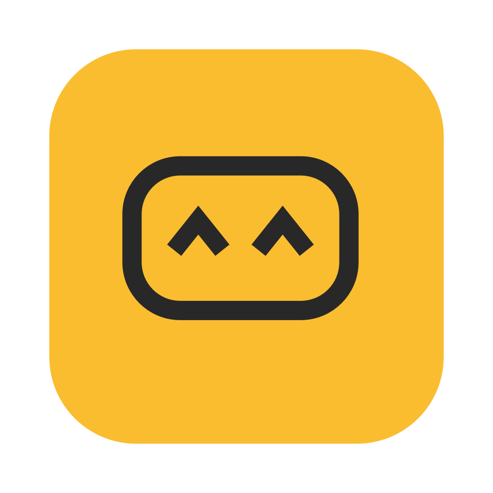
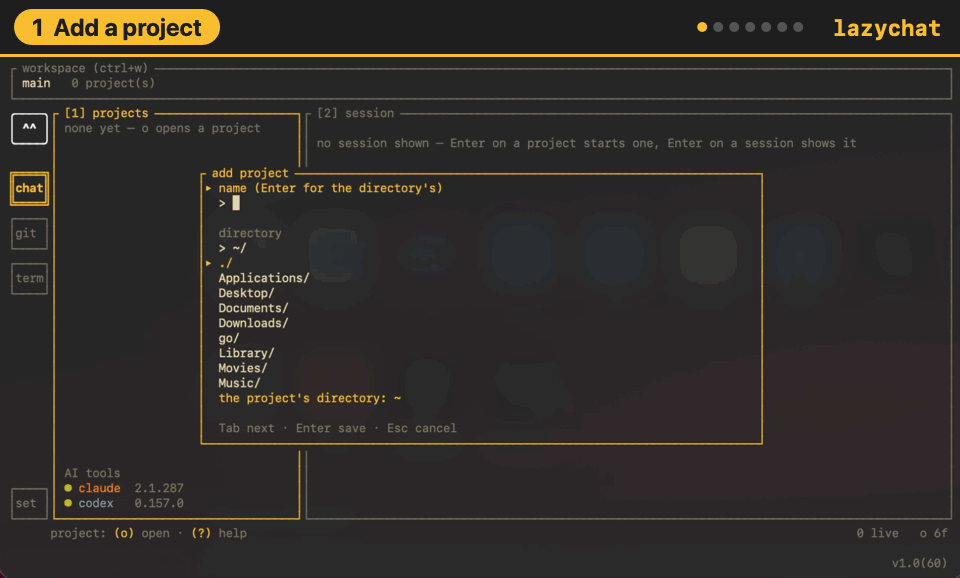

<p align="center">
  
</p>

<h1 align="center">lazychat</h1>

<p align="center">
  <b>One terminal for all your AI coding agents.</b><br>
  Run Claude Code and Codex sessions side by side, see at a glance which one needs you,<br>
  and keep Git and a shell for every project one key away.
</p>

<p align="center">
  <a href="https://github.com/perpeer/lazychat/stargazers"></a>
  <a href="https://github.com/sponsors/Perpeer"></a>
  <a href="#install"></a>
  
  
  <a href="LICENSE"></a>
</p>

<p align="center">
  <a href="https://perpeer.github.io/lazychat/">Website</a> ·
  <a href="#install">Install</a> ·
  <a href="#quick-start">Quick start</a> ·
  <a href="#features">Features</a> ·
  <a href="#sponsor-lazy">Sponsor Lazy ♥</a> ·
  <a href="#contributing">Contributing</a>
</p>

<p align="center">
  
</p>

## Install

You need a Mac (Apple silicon or Intel, macOS 12 or newer) and an AI coding
agent you are logged in to: [Claude Code](https://code.claude.com/docs) or
[Codex](https://github.com/openai/codex).

### Homebrew

```sh
brew install perpeer/tap/lazychat
```

Homebrew builds lazychat on your Mac, along with Lazy's menu bar app, so
macOS opens both without a warning. Then run `lazychat`; `lazychat doctor`
says what else is ready. Lazy starts with lazychat; `brew services start
lazychat` keeps it in the menu bar from every login. `brew upgrade
lazychat` takes a new release; lazychat tells you in green, beside its
version, when one is out.

lazychat comes from our own tap for now. Homebrew's own list takes it at
225 stars, and then it is just `brew install lazychat`. If it saves you a
few tabs, [star it](https://github.com/perpeer/lazychat/stargazers): every
star helps lazychat reach more people.

### From the source

```sh
git clone https://github.com/perpeer/lazychat
cd lazychat
./install.sh
```

The script checks your Mac first and tells you what is missing and how to
get it; `./install.sh --check` does only that. It installs Go with Homebrew
if you don't have it (an older Go fetches the one lazychat needs by
itself), builds `~/.local/bin/lazychat` and adds Lazy's menu bar app to
Applications.

To remove lazychat, run `brew uninstall lazychat`, or `./uninstall.sh` for
a source install. Your settings and workspaces stay (`./uninstall.sh
--purge` takes them too); your projects and the agents' own files are
never touched.

## Quick start

1. Run `lazychat` and name a workspace, the set of projects you work on.
2. Press `o` and pick a project folder.
3. Press `n` to start Claude Code or Codex in it, `Enter` to type to it,
   and `ctrl+q` to come back.
4. `Tab` moves between the tabs, and `?` lists every key where you are.

`lazychat doctor` tells you which agents are ready, and why not.

## Features

### Chat: your agents, side by side

Every session sits under its project with its terminal next to it. You can
see which one works, which one waits for you and how long the last prompt
took. `n` starts one, `r` resumes an old one, and `w` lets you draft the
next prompt while the agent is still busy. `/` finds a session by name
across every project; `i`, or a click on Lazy while several wait, opens
the inbox: the sessions asking you something or finished, Enter opens
one. Under each project the tree says what its sessions used today. Press `3` for the details. At
the top is the prompt's flow, drawn like `git log --graph`: each tool it
called in order with the file it touched or the command it ran, a
subagent as a branch that forks off and joins back when it returns, a
question to you, and what each step added to the context. Beside it is the session's context, drawn like Claude
Code's `/context`: how full the window is, what fills it, which tool's
results took the most, and how many more prompts fit at this pace. At the
bottom are your prompt reports: what the picked prompt ran, and your last
ten prompts as a table with their tokens and API price. Lazy also plays a sound when a session starts
on a prompt, asks you something, finishes or fails; you can turn the
sounds off in Settings.

```
┌ [1] projects ──────────┐┌ [2] session │ [3] details ───────────┐
│ garden-shed            ││ ❯ paint the shed blue                │
│ main                   ││                                      │
│   │                    ││ ● Starting with the north wall.      │
│   ├─ ● ivy             ││   Reading paint.go…                  │
│   │    claude · 42s    ││                                      │
│   │                    ││ > ▌                                  │
│   └─ ○ oak             ││                                      │
│        codex · 3m 18s  ││                                      │
└────────────────────────┘└──────────────────────────────────────┘
session: (enter) continue · (n) new · (r) resume · (w) draft · (?) help
```

### Git: stage, diff and commit without leaving

Changes as a folder tree, a diff you can walk line by line with the code
in its language's colours — `v` selects lines, `space` stages just
those — your last commits and the repository's worktrees. `Suggest` asks the agent for a
commit message written from what you staged.

```
┌ [1] projects ──┐┌ [2] Unstaged · 1 ────┐┌ [5] diff ──────────────────┐
│ garden-shed    ││ M paint.go           ││ @@ -3,2 +3,2 @@            │
│ main ↑1        │└──────────────────────┘│ - color := "red"           │
│                │┌ [3] Staged · 1 ──────┐│ + color := "blue"          │
│ blue-door      ││ + door.go            ││                            │
│ worktree       │└──────────────────────┘└────────────────────────────┘
│                │┌ [4] commits ─────────┐┌ [6] commit ────────────────┐
│                ││ ↑ a1b2c3d first coat ││ Paint the door blue        │
│                ││   9f8e7d6 sand it    ││────────────────────────────│
│                ││                      ││      [ Suggest ] [ Commit ]│
│                ││                      ││                            │
└────────────────┘└──────────────────────┘└────────────────────────────┘
branch: (c) commit · (p) pull · (shift+p) push · (b) branches · (w) worktrees
```

### Terminal: a shell in every project

Plain shells in your projects' folders, for the things the agents don't
do.

```
┌ [1] projects ──────┐┌ [2] sh 1 ──────────────────────────────┐
│ garden-shed        ││ $ go test ./...                        │
│ main               ││ ok   shed/paint   0.4s                 │
│   │                ││ $ ▌                                    │
│  ├─ ● sh 1         ││                                        │
│  │                 ││                                        │
│  └─ ○ server       ││                                        │
└────────────────────┘└────────────────────────────────────────┘
terminal: (enter) continue · (n) new · (e) rename · (v) copy · (d) close
```

Settings holds the theme, which tabs show and which agent writes your
commit messages. Every key and screen is in the
[reference](docs/REFERENCE.md).

## Sponsor Lazy

<p align="center">
  <a href="https://github.com/sponsors/Perpeer"></a>
</p>

Lazy watches your agents all day and has never asked for anything.
lazychat is free and stays free; if it saves you time, keep Lazy going:

<p align="center">
  ☕ <b>$3</b> a coffee · 🍩 <b>$10</b> a snack · 🛋️ <b>$50</b> a comfy cushion · 🚀 <b>$100+</b> super sponsor
</p>

<p align="center">
  <a href="https://github.com/sponsors/Perpeer"></a>
</p>

## Inspiration

lazychat follows [lazygit](https://github.com/jesseduffield/lazygit) and
[lazydocker](https://github.com/jesseduffield/lazydocker) by Jesse
Duffield: terminal UIs where everything is one key away. lazychat does the
same for AI coding agents.

## License

AGPL-3.0, see `LICENSE`. lazychat is free to use, change and share; a
changed copy that is shipped, sold or run as a service has to stay open
source too, and keeps the credit in `NOTICE`.

## Contributing

Bug reports, ideas and pull requests are welcome: open an
[issue](https://github.com/perpeer/lazychat/issues) and tell us which agent
lazychat should support next. [CONTRIBUTING.md](CONTRIBUTING.md) explains
how the code fits together and how it is tested.

<a href="https://github.com/Perpeer/lazychat/graphs/contributors">
  
</a>
